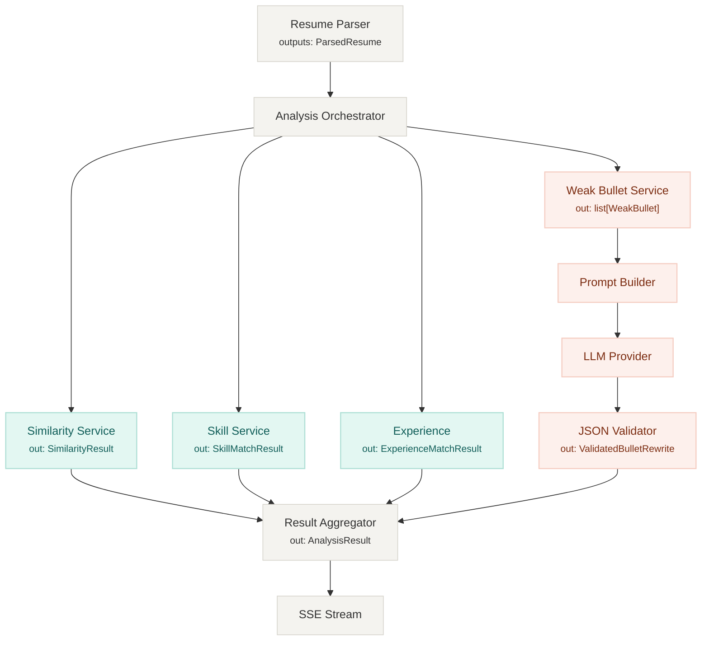

# Backend Architecture Preview

You can preview the interactive diagram below using your editor's Markdown preview (`Cmd + Shift + V` on Mac, `Ctrl + Shift + V` on Windows/Linux).

```mermaid
graph TD
    classDef default fill:#f4f3ef,stroke:#d5d3cb,stroke-width:1px,color:#333,font-family:sans-serif;
    classDef fastService fill:#e3f7f2,stroke:#aedfd5,stroke-width:1.5px,color:#115e59,font-family:sans-serif;
    classDef llmService fill:#fdf0ec,stroke:#f5cdc2,stroke-width:1.5px,color:#7c2d12,font-family:sans-serif;

    Parser["Resume Parser<br/><small>outputs: ParsedResume</small>"]
    Orchestrator["Analysis Orchestrator"]
    
    Sim["Similarity Service<br/><small>out: SimilarityResult</small>"]:::fastService
    Skill["Skill Service<br/><small>out: SkillMatchResult</small>"]:::fastService
    Exp["Experience<br/><small>out: ExperienceMatchResult</small>"]:::fastService
    
    Weak["Weak Bullet Service<br/><small>out: list[WeakBullet]</small>"]:::llmService
    Builder["Prompt Builder"]:::llmService
    LLM["LLM Provider"]:::llmService
    Validator["JSON Validator<br/><small>out: ValidatedBulletRewrite</small>"]:::llmService
    
    Aggregator["Result Aggregator<br/><small>out: AnalysisResult</small>"]
    Stream["SSE Stream"]
    
    Parser --> Orchestrator
    Orchestrator --> Sim
    Orchestrator --> Skill
    Orchestrator --> Exp
    Orchestrator --> Weak
    
    Sim --> Aggregator
    Skill --> Aggregator
    Exp --> Aggregator
    
    Weak --> Builder
    Builder --> LLM
    LLM --> Validator
    Validator --> Aggregator
    
    Aggregator --> Stream
```
